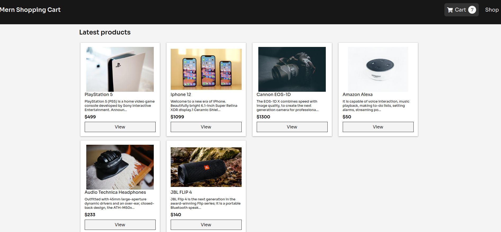
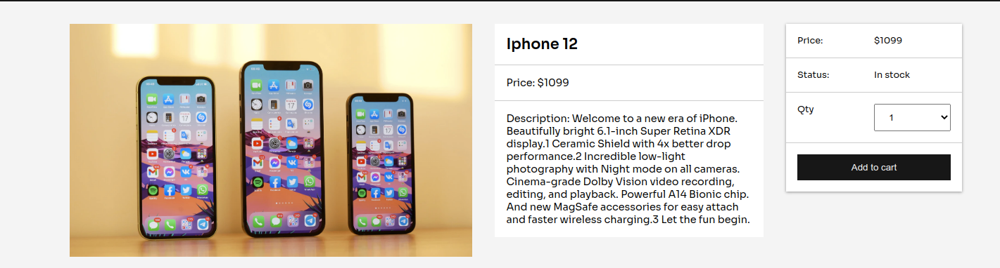
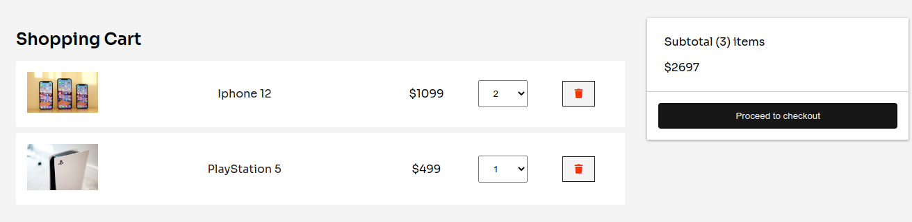
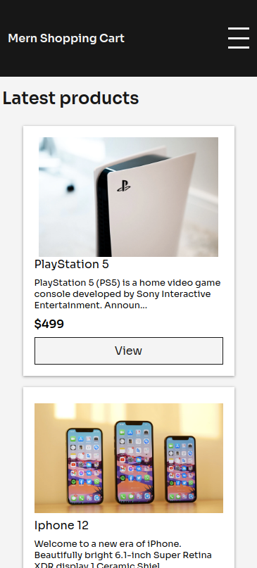
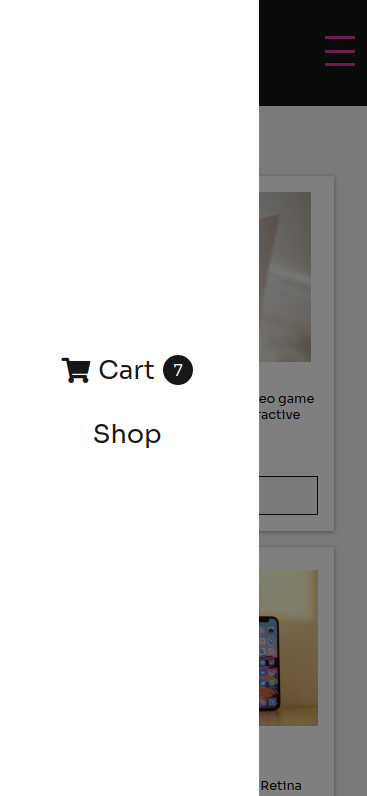

# Aplicacion e-commerce sencilla

Desarrollado con React, express, nodejs, mongoDb.

Para instalar aplicacion ejecutar:

```
npm install 
cd frontend && npm install
```

Para iniciar aplicacion ejecutar

```
npm run data:import
npm run dev
```

------

Imagenes de aplicacion:







Mobile:



